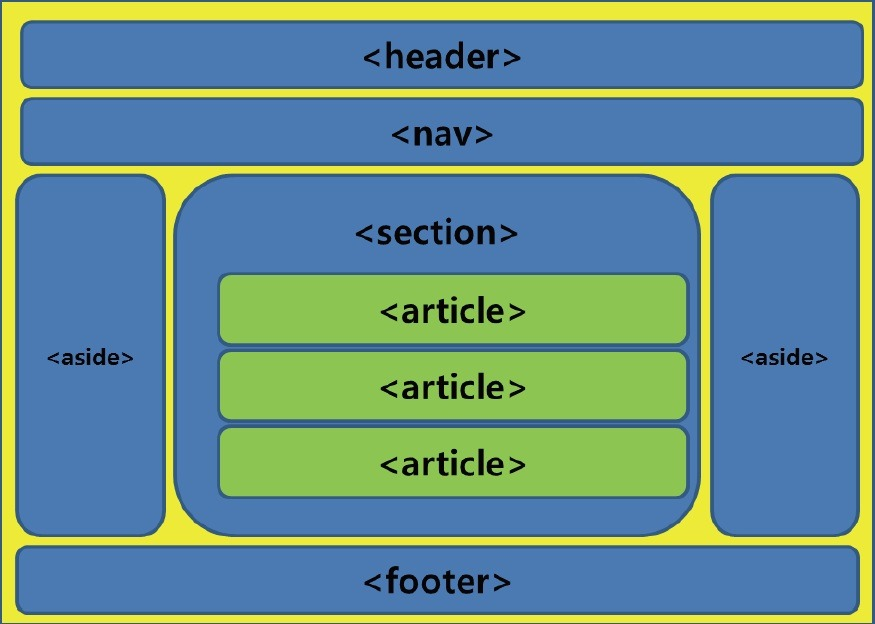

## 시맨틱 태그

### 공간분할

* 블록 형식 : 각 태그가 한 행을 모두 차지. div

* 인라인 형식 : 각 태그는 자신의 글자 크기만큼만의 영역을 차지하고 행을 넘지 않음. span

  | 블록 형식 태그 | 인라인 형식 태그 |
  | -------------- | ---------------- |
  | div            | span             |
  | h1~h6          | a 태그           |
  | p 태그         | input 태그       |
  | 목록 태그      | 글자 형식 태그   |
  | 테이블 태그    | 입력 양식 태그   |

### 시맨틱 태그

> 각 태그가 어떤 기능을 하는지 시각적으로 분별하기 위해 특정 태그에 의미를 부여하여 구조화

