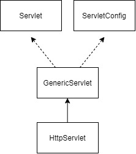

## 서블릿-개념 및 생성

> 서버 쪽에서 실행되면서 클라이언트 요청에 따라 동적으로 서비스를 제공하는 자바 클래스

* 서브 쪽에서 실행되면서 여러 가지 기능(동적) 수행
* 스레드 방식으로 실행
* 컨테이너(톰캣 등)에서 실행
* 웹 브라우저(클라이언트) 요청 시 기능 수행

### 서블릿 AIP 계층 구조

* 서블릿 API는 Servlet 과 ServletConfig 인터페이스 구현하여 제공
* GenericServlet 추상 클래스가 두 인터페이스의 추상 메서드 구현
* HttpServlet이 GenericServlet을 상속

### 서블릿 생명주기(Life Cycle) 메서드

> 서블릿 실행 단계마다 호출되어 기능을 수행하는 콜백 메서드

| 생명주기 단계    | 호출 메서드         | 특징                                                         |
| ---------------- | ------------------- | ------------------------------------------------------------ |
| 초기화           | init()              | * 서블릿 요청 시 맨 처음 한번만 호출 * 서블릿 생성 시 초기화 작업을 주로 수행 |
| 서비스(작업수행) | doGet() doPost() | * 서블릿 요청 시 매번 호출 * 실제로 클라이언트가 요청하는 작업 수행 * **do로 시작하는 메서드는 서블릿의 핵심기능을 처리하므로 반드시 구현** |
| 종료             | destroy()           | * 서블릿이 기능을 수행하고 메모리에서 소멸될 때 호출 * 서블릿의 마무리 작업을 주로 수행 |

