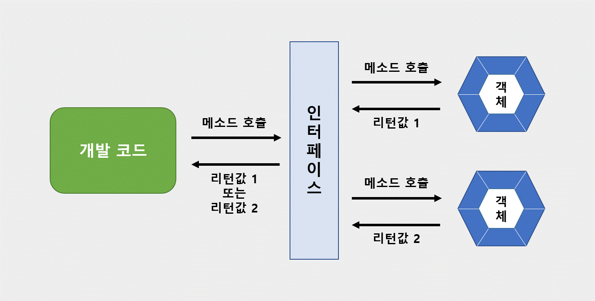

## 인터페이스

> 객체의 사용 방법을 정의한 타입으로 개발 코드와 객체가 서로 통신하는 접점 역할.
>
> 개발 코드가 인터페이스의 메소드를 호출하면 인터페이스는 객체의 메소드를 호출.
>
> 개발 코드를 수정하지 않고 사용하는 객체를 변경하기 위해서 사용




`선언` : File -> New -> Interface

```java
[public] interface 인터페이스명 {
 	// 상수 : 상수 필드만 선언 가능. 인터페이스에 고정된 값으로 초기화없이 데이터 바꿀 수 없음
	타입 상수명 = 값;
	// 추상메소드 : 객체가 가지고 있는 메소드 설명
	타입 메소드명(매개변수,...);
	// 디폴트 메소드 : 인터페이스에 선언되지만 사실은 구현 객체가 가지고 있는 인스턴스 메소드
	default 타입 메소드명(매개변수,...){...}
	// 정적 메소드 : 디폴트 메소드와는 달리 객체가 없어도 인터페이스만으로 호출 가능
	static 타입 메소드명(매개변수){...}
}
```


### 인터페이스 구현

`구현 클래스`

```java
public class 구현클래스명 implements 인터페이스명 {
    // 인터페이스에 선언된 추상 메소드의 실체 메소드 선언
}
```

* 실체 메소드는 public 으로만 생성 가능

* 구현 클래스에서 추상 메소드에 대한 실체 메소드를 작성하지 않으면 선언부에 abstract 키워드 추가

  ```java
  public abstract class Television implements RemoteControl {
      // 인터페이스에 선언된 추상 메소드 전부에 대해서 실체 메소드를 작성해야함. 아니면 abstract 추가
  }
  ```

  

