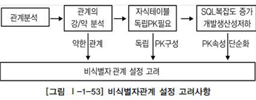

## 식별자

> 하나의 엔터티에 구성된 여러 개의 속성 중 엔터티를 대표할 수 있는 속성
>
> 하나의 엔터티는 반드시 하나의 유일한 식별자가 존재해야함

#### 특징

`주식별자의 특징`

| 특징   | 내용                                                         |
| ------ | ------------------------------------------------------------ |
| 유일성 | 주식별자에 의해 엔터티 내에 모든 인스턴스들을 유일하게 구분함 |
| 최소성 | 주식별자를 구성하는 속성의 수는 유일성을 만족하는 최소의 수가 되어야함 |
| 불변성 | 주식별자가 한 번 특정 엔터니에 지정되면 그 식별자의 값은 변하지 않아야함 |
| 존재성 | 주식별자가 지정되면 반드시 데이터 값이 존재(Null 불가)       |

#### 식별자의 분류

<table>
    <tr>
    	<td>분류</td>
        <td>식별자</td>
        <td>설명</td>
    </tr>
    <tr>
    	<td rowspan="2">대표성 여부</td>
        <td>주식별자</td>
        <td>엔터티 내에서 각 어커런스를 구분할 수 있는 구분자이며, 타 엔터티와 참조관계를 연결할 수 있는 식별자</td>
    </tr>
    <tr>
    	<td>보조식별자</td>
        <td>엔터티 내에서 각 어커런스를 구분할 수 있는 구분자이나 대표성을 가지지 못해 참조관계 연결을 못함</td>
    </tr>
    <tr>
    	<td rowspan="2">스스로 생성 여부</td>
        <td>내부식별자</td>
        <td>엔터티 내부에서 스스로 만들어지는 식별자</td>
    </tr>
    <tr>
    	<td>외부식별자</td>
        <td>타 엔터티와의 관계를 통해 타 엔터티로부터 받아오는 식별자</td>
    </tr>
    <tr>
    	<td rowspan="2">속성 수</td>
        <td>단일식별자</td>
        <td>하나의 속성으로 구성된 식별자</td>
    </tr>
    <tr>
    	<td>복합식별자</td>
        <td>둘 이상의 속성으로 구성된 식별자</td>
    </tr>
    <tr>
    	<td rowspan="2">대체 여부</td>
        <td>본직식별자</td>
        <td>업무에 의해 만들어지는 식별자</td>
    </tr>
    <tr>
        <td>인조식별자</td>
        <td>업무적으로 만들어지지는 않지만 원조식별자가 복잡한 구성을 갖고 있기 때문에 인위적으로 만든 식별자</td>
    </tr>
</table>

#### 식별자의 표기법

#### 주식별자 도출기준

* 해당 업무에서 자주 이용되는 속성을 지정
* 명칭, 내역 등과 같이 이름으로 기술되는 것은 피함
* 속성의 수가 많아지지 않도록 함

#### 외부식별자

> 자기 자신의 엔터티에서 필요한 속성이 아니라 다른 엔터티와의 관계를 통해 자식 쪽 엔터티에 생성되는 속성
>
> 데이터베이스 생성 시 Foreign Key 역할
>
> - 식별자관계 : 부모로부터 받은 식별자를 자식엔터티의 주식별자로 이용하는 경우
>
> - 비식별자관계 : 부모로부터 받은 속성을 자식엔테티의 주식별자로 사용하지 않고 일반적인 속성으로만 사용

* 식별자 관계로만 설정할 경우 문제점 : 복잡성을 증가. PK속성의 수가 데이터 모델의 흐름이 길어질수록 증가할 수밖에 없는 구조
* 비식별자관게로만 설정할 경우 문제점 : 자식엔터티에서 데이터를 처리할 때 부모엔터티까지 찾아가야 하는 경우 발생
* 비식별자관계 선택 프로세스

​	

| 항목               | 식별자관계                                                   | 비식별자관계                                                 |
| ------------------ | ------------------------------------------------------------ | ------------------------------------------------------------ |
| 목적               | 강한 연결관계 표현                                           | 약한 연결관계 표현                                           |
| 자식 주시별자 영향 | 자식 주식별자의 구성에 포함됨                                | 자식 일반속성에 포함됨                                       |
| 표기법             | 실선 표현                                                    | 점선 표현                                                    |
| 연결 고려사항      | 반드시 부모엔터티 종속 자식 주식별자 구성에 부모 주식별자 포함 필요 상속받은 주식별자속성을 타 엔터티에 이전 필요 | 약한 종속관계 자식 주식별자 구성을 독립적으로 구성 자식 주식별자 구성에 부모 주식별자 부분 필요 상속받은 주식별자속성을 타 엔터티에 차단 필요 부모쪽의 관계참여가 선택관계 |

