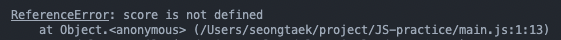

## 변수

변수 (variable) : 하나의 값을 저장하기 위해 확보한 메모리 공간 자체 또는 그 메모리 공간을 식별하기 위해 붙인 이름

Mdn에서의 정의 : 값을 저장하기 위해 명명된 위치


메모리 공간에 저장된 값을 다시 읽어 재사용할 수 있도록 값이 저장된 메모리 공간에 상징적인 이름을 붙인 것이 바로 변수


##### 변수가 왜 필요할까? 

연산 결과와 같은 특정한 값을 재사용하려면 값이 저장되어 있는 메모리에 접근해야 되는데 메모리 주소를 통해 값에 직접 접근하는 것보다 변수를 통해 안전하게 값에 접근하기 위함


변수명 (변수이름) : 메모리 공간에 저장된 값을 식별할 수 있는 고유한 이름

변수값 : 변수에 저장된 값

할당 (assignment / 대입, 저장) : 변수에 값을 저장하는 것

참조 (reference) : 변수에 저장된 값을 읽어 들이는 것


식별자(identifier) : 어떤 값을 구별해서 식별할 수 있는 고유한 이름. 값이 아니라 메모리 주소를 기억하고 있음. 다시 말해서 메모리 주소에 붙인 이름이라고도 할 수 있음

변수명뿐 아니라 변수, 함수, 클래스 등의 이름을 모두 식별자라고 함


#### 변수 선언 (variable declaration)

변수 선언 : 변수를 생성하는 것. 값을 저장하기 위한 메모리 공간을 확보하고 변수 이름과 확보된 메모리 공간의 주소를 연결하여 값을 저장할 수 있게 준비하는 것.

변수를 사용하기 위해서는 반드시 선언이 필요하며, 변수를 선언할 때는 var, let, const 키워드를 사용함

```js
var score;
```

위의 예시문에서는 변수를 선언하고 값을 할당하지 않았는데, 자바스크립트 엔진에 의해 확보된 메모리 공간에 undefined 라는 값을 할당하여 초기화

이를 initialization 이라고 하며 var 키워드에서만 해당. let, const 로 선언한 변수는 선언 전에 사용시 ReferenceError가 발생.


##### 자바스크립트 엔진이 변수 선언을 수행하는 과정

1. 선언 단계 : 변수 이름을 등록해서 자바스크립트 엔진에 변수의 존재를 알린다.
2. 초기화 단계 : 값을 저장하기 위한 메모리 공간을 확보하고 암묵적으로 undefined 를 할당하여 초기화


변수를 사용하기 위해서는 반드시 변수 선언이 필요하며, 선언하지 않은 식별자에 접근하면 ReferenceError(참조 에러)가 발생.




#### 변수 호이스팅

변수 선언은 런타임 시점에서 실행되는 것이 아니라 그 이전 단계에서 실행되게 됨.

따라서 변수 선언문은 코드의 선두로 끌어 올려진 것처럼 동작하는데 이를 변수 호이스팅이라 함.

```js
console.log(scroe); // undefined

var score;
```

위의 예시문에서 score 변수의 선언이 런타임보다 먼저 실행되기 때문에 ReferenceError를 발생하는게 아닌 undifined 를 출력


#### 할당 (assignment)

할당 연산자 = 를 사용하며, 우변의 값을 좌변의 변수에 할당

```js
var score; // 변수 선언
score = 80; // 값의 할당
```


변수 선언과 할당을 하나의 문으로 표현할 수도 있다.

```js
var score = 80;
```

위처럼 선언과 할당을 하나의 문으로 단축 표현해도 자바스크립트 엔진은 2개의 문으로 나누어 각각 실행하며,

변수 선언은 런타임 이전에 값의 할당은 소스코드가 순차적으로 실행되는 시점인 런타임에 실행


#### 값의 재할당

재할당 : 이미 값이 할당되어 있는 변수에 새로운 값을 또다시 할당하는 것

```js
var score = 80;
score = 90;
```

재할당을 하게 되면 score 변수의 값은 이전 값 80에서 재할당한 값 90으로 변경되는데 이 때 80이 저장되어있던 메모리 값을 지우고 90을 할당하는 것이 아니라,

새로운 메모리 공간을 확보하고 그 메모리 공간에 숫자 값 90을 할당한다.


이 때 이전 값인 80과 undefined 는 어떤 식별자와도 연결되지 않은 상태가 되고 이러한 불필요한 값들은 가비지 콜렉터에 의해 메모리에서 자동 해제됨.


##### 식별자 네이밍 규칙

- 특수문자를 제외한 문자, 숫자, 언더스코어(_), 달러기호($)를 포함할 수 있다.
- 숫자로 시작하는 것은 금지
- 예약어는 식별자로 사용 금지

| abstract | arguments  |    await*    |  boolean  |
| :------: | :--------: | :----------: | :-------: |
|  break   |    byte    |     case     |   catch   |
|   char   |   class*   |    const     | continue  |
| debugger |  default   |    delete    |    do     |
|  double  |    else    |    enum*     |   eval    |
| export*  |  extends*  |    false     |   final   |
| finally  |   float    |     for      | function  |
|   goto   |     if     |  implements  |  import*  |
|    in    | instanceof |     int      | interface |
|   let*   |    long    |    native    |    new    |
|   null   |  package   |   private    | protected |
|  public  |   return   |    short     |  static   |
|  super*  |   switch   | synchronized |   this    |
|  throw   |   throws   |  transient   |   true    |
|   try    |   typeof   |     var      |   void    |
| volatile |   while    |     with     |   yield   |

Words marked with* are new in ECMAScript 5 and 6.


##### 네이밍 컨벤션 : 가독성 좋게 단어를 구분하기 위해 규정한 명명 규칙

```js
// 카멜 케이스 (camelCase) : 중간 단어만 첫 글자를 대문자로
var firstName;

// 파스칼 케이스 (PascalCase) : 첫 단어와 중간 단어 모두 첫 글자를 대문자로
var FirstName;

// 스네이크 케이스 (snake_case) : 단어 사이를 언더바(_)로 연결
var first_name;

// 헝가리언 케이스(typeHungarianCase) : 변수의 타입을 같이 명시
var strFirstName; // type + identifier
var $elem = document.getElementById('myId'); // DOM node
var 
```


참조 : 모던자바스크립트 Deep Dive