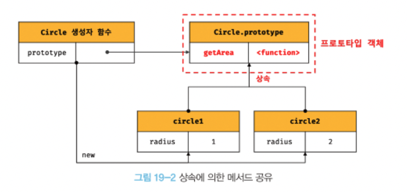
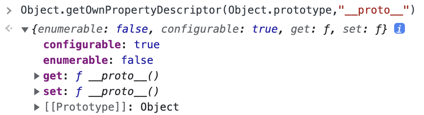
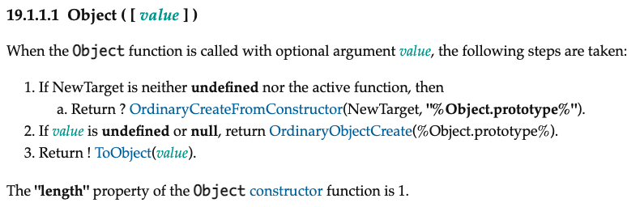
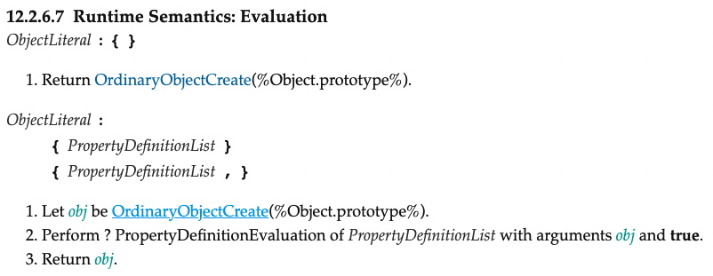
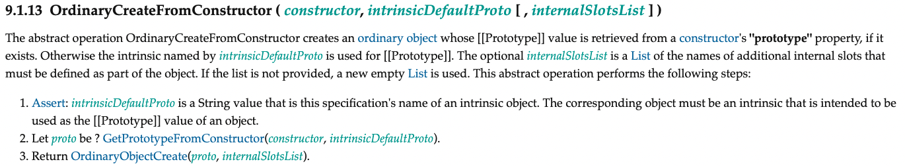

# 19. 프로토타입

자바스크립트는 프로토타입 기반의 객체지향 프로그래밍 언어

자바스크립트는 객체 기반의 프로그래밍 언어이며, 자바스크립트를 이루고 있는 거의 모든 것이 객체다. (원시값을 제외한 나머지 값은 모두 객체)


## 19.1 객체지향 프로그래밍

객체 : 속성을 통해 여러 개의 값(상태 데이터, 동작)을 하나의 단위로 구성한 복합적인 자료구조

객체지향 프로그래밍 : 독립적인 객체의 집합으로 프로그램을 표현하려는 프로그래밍 패러다임

객체지향 프로그래밍은 객체의 상태를 나타내는 데이터와 상태 데이터를 조작할 수 있는 동작을 하나의 논리적인 단위로 묶어 생각하는데,

따라서 객체는 상태 데이터와 동작을 하나의 논리적 단위로 묶은 복합적인 자료구조이며, 객체의 상태 데이터를 **프로퍼티(property)**, 동작을 **메서드(method)**라고 함


## 19.2 상속과 프로토타입

**상속 (inheritance)** : 객체지향 프로그래밍의 핵심 개념으로, 어떤 객체의 프로퍼티 또는 메서드를 다른 객체가 상속받아 그대로 사용할 수 있는 것

자바스크립트는 프로토타입을 기반으로 상속을 구현하여, 기존의 코드를 적극적으로 재사용함으로써 불필요한 중복을 제거함

```js
// 생성자 함수
function Circle(radius) {
  this.radius = radius;
}

// Circle 생성자 함수가 생성한 모든 인스턴스가 getArea 메서드를 공유해서 사용할 수 있도록 프로토타입에 추가
// 프로토타입은 Circle 생성자 함수의 prototype 프로퍼티에 바인딩되어 있다.
Circle.prototype.getArea = function () {
  return Math.PI * this.radius ** 2;
};

// 인스턴스 생성
// Circle 생성자 함수가 생성하는 모든 인스턴스는 자신의 상태를 나타내는 radius 프로퍼티만 개별적으로 소유하고, 
// 내용이 동일한 getArea 메서드를 상속받아 사용할 수 있다. (중복 방지)
const circle1 = new Circle(1);
const circle2 = new Circle(2);

// Circle 생성자 함수가 생성한 모든 인스턴스는 부모 객체의 역할을 하는 프로토타입 Circle.prototype 으로부터 getArea 메서드를 상속받는다.
// 즉, Circle 생성자 함수가 생성하는 모든 인스턴스는 하나의 getArea 메서드를 공유한다.
console.log(circle1.getArea === circle2.getArea); // true

console.log(circle1.getArea());
console.log(circle2.getArea());
```




## 19.3 프로토타입 객체

프로토타입 객체는 객체지향 프로그래밍의 근간을 이루는 객체 간 상속을 구현하기 위해 사용됨

모든 객체는 [[Prototype]] 이라는 내부 슬롯을 가지며, 이 내부 슬롯의 값은 프로토타입의 참조다. (null 인 경우도 있음)

모든 객체는 하나의 프로토타입을 가지며, 모든 프로토타입은 생성자 함수와 연결되어 있다.

[[Prototype]] 내부 슬롯에는 직접 접근 불가, `__proto__` 접근자 프로퍼티를 통해 [[Prototype]] 내부 슬롯이 가리키는 프로토타입에 간접 접근 가능

프로토타입은 자신의 constructor 프로퍼티를 통해 생성자 함수에 접근할 수 있고, 생성자 함수는 자신의 prototype 프로퍼티를 통해 프로토타입에 접근 가능


### 19.3.1 `__proto__` 접근자 프로퍼티

모든 객체는 `__proto__` 접근자 프로퍼티를 통해 자신의 프로토타입, 즉 [[Prototype]] 내부 슬롯에 간접적으로 접근 가능


##### 1. `__proto__` 는 접근자 프로퍼티다.

접근자 프로퍼티 : 자체적으로 값([Value] 어트리뷰트)를 갖지 않고, 다른 데이터 프로퍼티의 값을 읽거나 저장할 때 쓰는 접근자 함수 ([[Get]], [[Set]] 프로퍼티 어트리뷰트)



Object.prototype 의 접근자 프로퍼티인 `__proto__` 는 getter/setter 함수라고 부르는 접근자 함수([[Get]], [[Set]])를 통해 [[Prototype]] 값인 프로토타입을 취득 or 할당

`__proto__` 접근자 프로퍼티를 통해 프로토타입에 접근하면 getter 함수인 [[Get]] 호출

`__proto__` 접근자 프로퍼티를 통해 프로토타입에 할당하면 setter 함수인 [[Set]] 호출

```js
const obj = {};
const parent = { x : 1 };

// getter 함수인 get __proto__가 호출되어 obj 객체의 프로토타입을 취득
obj.__proto__;

// setter 함수인 set __proto__가 호출되어 obj 객체의 프로토타입을 교체
obj.__proto__ = parent;

console.log(obj.x); // 1
```


##### 2. `__proto__` 접근자 프로퍼티는 상속을 통해 사용된다.

`__proto__` 접근자 프로퍼티는 객체가 직접 소유하는 프로퍼티가 아니라 Object.prototype의 프로퍼티

모든 객체는 상속을 통해 `Object.prototype.__proto__` 접근자 프로퍼티를 사용할 수 있다.


##### 3. `__proto__` 접근자 프로퍼티를 통해 프로토타입에 접근하는 이유

[[Prototype]] 내부 슬롯의 값, 즉 프로토타입에 접근하기 위해 접근자 프로퍼티를 사용하는 이유는 상호 참조에 의해 프로토타입 체인이 생성되는 것을 방지하기 위해서이다.

```js
const parent = {};
const child = {};

// child의 프로토타입을 parent로 설정
child.__proto__ = parent;
// parent의 프로토타입을 child로 설정
parent.__proto__ = child; // TypeError : Cyclic __proto__ value
```

프로토타입 체인은 단방향 링크드 리스트로 구현되어야 한다. 즉, 프로퍼티 검색 방향이 한쪽 방향으로만 흘러가야 한다.

위의 예제와 같이 순환 참조(circular reference) 하는 프로토타입 체인이 만들어지면 프로토타입 체인 종점이 존재하지 않기 때문에 무한 루프에 빠진다.

따라서 아무 체크없이 무조건적으로 프로토타입을 교체할 수 없도록 `__proto__` 접근자 프로퍼티를 통해 프로토타입에 접근하고 교체하도록 구현되어 있다.


##### 4. `__proto__` 접근자 프로퍼티를 코드 내에서 직접 사용하는 것은 권장하지 않는다.

모든 객체가 `__proto__` 접근자 프로퍼티를 사용할 수 있는 것은 아니기 때문에, 코드 내에서 `__proto__` 접근자 프로퍼티를 직접 사용하는 것은 권장하지 않음

직접 상속을 통해 Object.prototype 을 상속받지 않은 객체를 생성할 수도 있기 때문에, `__proto__` 접근자 프로퍼티를 사용할 수 없는 경우가 있음

```js
// obj는 프로토타입 체인의 종점이다. 따라서 Object.__proto__ 를 상속받을 수 없다.
const obj = Object.create(null);

// obj는 Object.__proto__를 상속받을 수 없다.
console.log(obj.__proto__); // undefined

// 따라서 __proto__ 보다 Object.getPrototypeOf 메서드를 사용하는 편이 좋다.
console.log(Object.getPrototype(obj)); // null
```

 따라서 `__proto__` 접근자 프로퍼티 대신 프로토타입의 참조를 취득하고 싶은 경우에는 `Object.getPrototypeOf` 메서드를 사용하고,

프로토타입을 교체하고 싶은 경우에는 `Object.SetprototypeOf` 메서드를 사용할 것을 권장

```js
const obj = {};
const parent = { x : 1 };

// obj 객체의 프로토타입을 취득
Object.getPrototypeOf(obj); // obj.__proto__;
// obj 객치의 프로토타입을 교체
Object.setPrototypeOf(obj, parent); // obj.__proto__ = parent;

console.log(obj.x); // 1
```


### 19.3.2 함수 객체의 prototype 프로퍼티

함수 객체만이 소유하는 prototype 프로퍼티는 생성자 함수가 생성할 인스턴스의 프로토타입을 가리킨다.

```js
// 함수 객체는 prototype 프로퍼티를 소유한다.
(function(){}).hasOwnProperty('prototype'); // true

// 일반 객체는 prototype 프로퍼티를 소유하지 않는다.
({}).hasOwnProperty('prototype'); // false
```

따라서 생성자 함수로서 호출할 수 없는 함수, non-constructor (화살표 함수, ES6 메서드 축약 표현으로 정의된 메서드)는 

prototype 프로퍼티를 소유하지 않으며, 프로토타입도 생성하지 않는다.

```js
// 화살표 함수는 non-construntor다.
const Person = name => {
  this.name = name;
};

// non-constructor는 prototype 프로퍼티를 소유하지 않는다.
console.log(Person.hasOwnProperty('prototype')); // false

// non-constructor는 프로토타입을 생성하지 않는다.
console.log(Person.prototype); // undefined

// ES6의 메서드 축약 표현으로 정의한 메서드는 non-constructor이다.
const obj = {
  foo(){}
}

// non-constructor는 prototype 프로퍼티를 소유하지 않는다.
console.log(obj.foo.hasOwnProperty('prototype'))

// non-constructor는 프로토타입을 생성하지 않는다.
console.log(obj.foo.prototype)
```

모든 객체가 가지고 있는 `__proto__` 접근자 프로퍼티와 함수 객체만이 가지고 있는 prototype 프로퍼티는 결국 동일한 프로토타입을 가리키지만 사용 주체가 다르다.

| 구분                        | 소유        | 값                | 사용 주체   | 사용 목적                                                    |
| --------------------------- | ----------- | ----------------- | ----------- | ------------------------------------------------------------ |
| `__proto__` 접근자 프로퍼티 | 모든 객체   | 프로토타입의 참조 | 모든 객체   | 객체가 자신의 프로토타입에 접근 또는 교체하기 위해 사용      |
| prototype 프로퍼티          | constructor | 프로토타입의 참조 | 생성자 함수 | 생성자 함수가 자신이 생성할 객체(인스턴스)의 프로토타입을 할당하기 위해 사용 |

```js
// 생성자 함수
function Person(name){
  this.name = name;  
}

const me = New Person('Lee');

// Person.prototype과 me.__proto__는 동일한 프로토타입을 가리킨다.
console.log(Person.prototype === me.__proto__); // true
```


### 19.3.3 프로토타입의 construntor 프로퍼티와 생성자 함수

모든 프로토타입은 constructor 프로퍼티를 갖는다. 이 constructor 프로퍼티는 prototype 프로퍼티로 자신을 참조하고 있는 생성자 함수를 가리킨다.

이 연결은 생성자 함수가 생성될 때, 즉 함수 객체가 생성될 때 이뤄진다.

```js
// 생성자 함수
function Person(name){
  this.name = name;
}

const me = new Person('Lee');

// me 객체의 생성자 함수는 Person
// me 객체의 프로토타입 Person.prototype 에 있는 constructor 프로퍼티를 상속받아 사용할 수 있다.
console.log(me.constructor === Person ); // true
```


## 19.4 리터럴 표기법에 의해 생성된 객체의 생성자 함수와 프로토타입

생성자 함수에 의해 생성된 인스턴스는 프로토타입의 constructor 프로퍼티에 의해 생성자 함수(인스턴스를 생성한 생성자 함수)와 연결

리터럴 표기법에 의한 객체 생성 방식과 같이, new 연산자와 함께 생성자 함수를 호출하여 인스턴스를 생성하는게 아닌 객체 생성 방식도 있다.

```js
// 객체 리터럴
const obj = {};

// 함수 리터럴 
const add = function(a, b){ return a + b };

// 배열 리터럴
const arr = [1, 2, 3];

// 정규 표현식 리터럴
const regexp = /is/ig;
```

리터럴 표기법에 의해 생성된 객체도 물론 프로토타입이 존재하지만, 

리터럴 표기법에 의해 생성된 객체의 경우 프로토타입의 constructor 프로퍼티가 가리키는 생성자 함수가 반드시 객체를 생성한 생성자 함수라고 할 수 없다.

```js
// obj 객체는 Object 생성자 함수로 생성한 객체가 아니라 객체 리터럴로 생성
const obj = {};

// 근데 obj 객체의 생성자 함수는 Object 생성자 함수다?
console.log(obj.constructor === Object); // true
```

위의 예제에서 객체 리터럴로 생성했는데 consturctor 가 Object와 연결되어있다. ECMAScript에 그렇게 정의되어 있기 때문

Object 생성자 함수에 인수를 전달하지 않거나 undefined 또는 null 을 인수로 전달하면서 호출하면,

내부적으로 추상연산 OrdinaryObjectCreate를 호출하여 Object.prototype을 프로토타입으로 갖는 빈 객체를 생성



https://262.ecma-international.org/11.0/#sec-object-value


```js
// 2. Object 생성자 함수에 의한 객체 생성
// 인수가 전달되지 않았을 때 추상 연산 OrdinaryObjectCreate를 호출하여 빈 객체를 생성한다.
let obj = new Object();
console.log(obj);

// 1. new.target이 undefined나 Object가 아닌 경우
// 인스턴스 -> Foo.prototype -> Object.prototype 순으로 프로토타입 체인이 생성된다.
class Foo extends Object {}
new Foo(); // Foo {}

// 3. 인수가 전달된 경우에는 인수를 객체로 변환한다.
// Number 객체 생성
obj = new Object(123);
console.log(obj);

// String 객체 생성
obj = new Object('123');
console.log(obj);
```


객체 리터럴이 평가될 때는 다음과 같이 추상 연산 OrdinaryObjectCreate를 호출하여 빈 객체를 생성하고 프로퍼티를 추가하도록 정의되어 있다.



