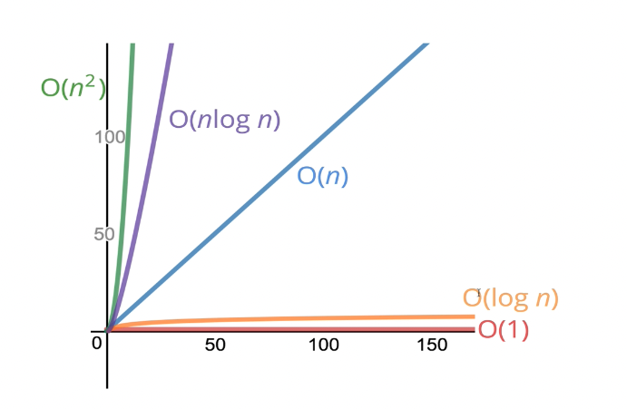

## 빅오 표기법

#### what does better mean?

* faster?
* Less memory-intensive?
* More readable?

시간을 사용해서 코드를 비교하는 것은 부정확할 수 있다.

-> 컴퓨터가 해야 하는 단순 동작들의 수를 계산

~~~ js
function addUpTo(n){
  return n * (n+1) / 2;
}
~~~

위 계산식은 n에 어떤 수가 오든 3번의 연산을 수행한다.

~~~js
function addUpTo(n){
  let total = 0;
  for(let i = 0; i<=n; i++){
    total += i;
  }
  return total;
}
~~~

위 계산식은 5n+2 번의 연산을 수행한다.

따라서 전자의 계산식이 더 효율적이라고 판단할 수 있다.

정확한 연산 횟수를 구하는 것이 목적이 아니라 전반적인 추세를 살피면 된다.

그래서 BigO 표기법을 사용한다.

### What is Big O 

빅오는 함수의 입력값의 크기와 입력값에 따라 변하는 시간의 관계를 묘사한 것

~~~ js
function printAllPairs(n) {
  for (var i = 0; i < n; i++) {
    for (var j = 0; j < n; j++) {
      console.log(i, j);
    }
  }
}
~~~

위 계산식은 n이 중첩되어 반복되므로 n^2 번의 연산을 수행한다.

#### 빅오 표기법

앞서 본 첫번째 예시에서는 n이 어떤 수이든 일정한 연산을 수행하기 때문에 O(1) 이라고 표기

두번째 예시에서는 5n+2 번의 연산을 수행하기 때문에 O(n) 이라고 표기

세번째 예시는 O(n^2) 로 표기

이 때 O(3), O(5n+2) 이라고 표기하지 않는 이유는 전반적인 추세만 살펴보면 되기 때문이다.

### 공간복잡도

* 시간 복잡도 : 입력값이 증가함에 따라 알고리즘을 실행하는 시간이 얼마나 되는지

* 공간 복잡도 : 입력값이 증가함에 따라 알고리즘이 차지하는 공간(메모리)이 어떻게 변하는지

#### Space Complexity in JS  : Rules of Thumbs

* most primitive(boolean, number, undefined, null) are constant space

* String require O(n) space (where n is the string length)

* Reference types are generally O(n), where n is the length(for arrays) or number of keys(for objects)

### 로그

로그 : 지수를 반대로 한 것

​	ex) Log2(8) = 3 : 2의 몇제곱이 8이 되는지 -> 2^3 = 8 , log2(value) = exponent -> 2^exponent = value

we'll omit the 2

Log === log2 : 빅오에서는 전반적인 추세(그래프)만 보기때문에 로그의 밑이 중요하지 않기 때문

탐색 알고리즘, 효율적인 정렬 알고리즘, 재귀 에서 쓰임

