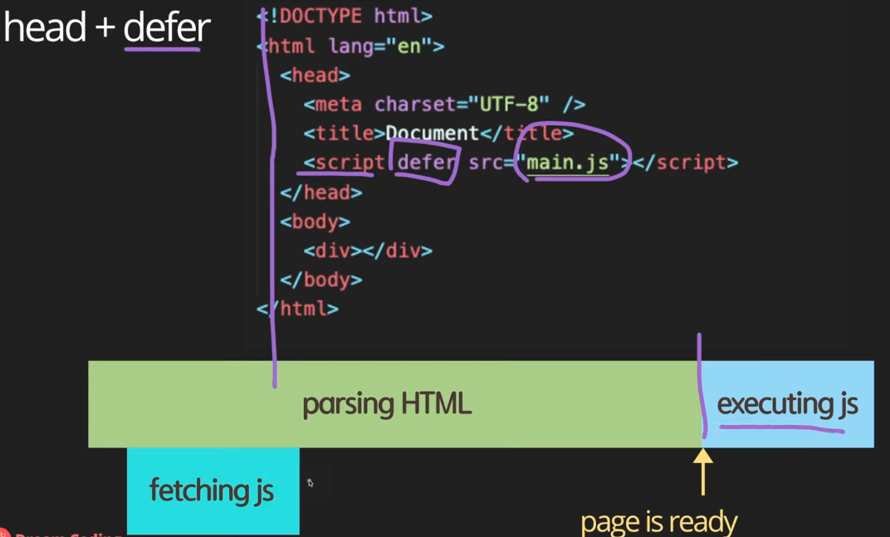

## Async vs defer

##### 1. Head 안에 script 포함

html을 한줄씩 파싱하다가 script 소스만나면 html 파싱 잠시 멈추고 js fetching하고 executing js 후에 다시 파싱

단점 : js파일이 크면 사용자가 웹사이트를 보는데 시간이 많이 걸림

##### 2. Body안(끝부분)에 script 포함

페이지가 js를 받기 전에도 페이지 컨텐츠를 볼 수 있다.

단점 : 사용자가 기본적인 html을 보긴 하지만, 웹사이트가 자바스크립트에 의존적이라면 사용자가 정상적으로 페이지를 보기전까지 기다려야함

 

##### 3. Head + async

html 파싱하다가 스크립트 안에 js 만나면 페칭 명령만 내려놓고  

장점 : fetching이 파싱하는 동안 병렬적으로 일어나기 때문에 다운로드 받는 시간 절약

단점 : html 파싱 되기전에 js가 실행되기 때문에 위험할 수 있음.

html 을 parsing이 자바스크립트를 실행하기 위해 멈출 수 있기 때문에 여전히 페이지를 보기까지 시간이 걸릴 수 있음

 

##### 4. Head + defer : 제일 좋음

Fetching 명령만 내려놓고 html parsing 이 끝나고 executing js

여러개를 실행하더라도 다운받아놓고 parsing 완료 후 에 순서대로 실행하기 때문에 효율적이고 안전함

 

**'Use strict';**

자바스크립트 이용시 제일 윗부분에 use strict 정의하는 것이 좋음

Why? JavaScript is very flexible

Flexible == dangerous

Use strict added ECMAScript 5

Strict mode로 개발해야 조금 더 상식적인 선에서 개발 가능

자바스크립트 엔진이 조금 더 효율적이고 빠르게 자바스크립트 분석 -> 실행시 약간의 성능개선 기대 가능