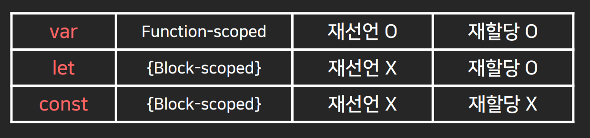

### 변수

##### 변수의 선언 / 할당

```js
var 이름 = 'john'
var 이름; // 변수의 선언
이름 = 'john' // 변수의 할당
```

##### 변수의 범위

var 변수의 범위 = function 

```js
function 어쩌구() {
  어쩌구 코드들
  var 나이 = 20;
}

console.log(나이); // undefined
```

```js
var 나이 = 20;

function 어쩌구() {
  console.log(나이); // 20
}
```

* 함수 밖에서 만든 변수는 함수 내에서도 자유롭게 사용가능

* 전역변수 : 가장 바깥에서 만든 전역에서 사용할 수 있는 변수

##### ES6 신문법 : let / const



##### 변수의 Hoisting

자바스크립트는 변수 선언부분을 항상 위로 강제로 끌어올려서 해석 (할당은 아니고 선언만)

실제로 위로 올리는건 아니고 L.E에서 선언된 변수를 수집하는 과정에서 맨 위로 끌어올려 해석하는 것과 같은 효과

함수 선언도 마찬가지로 코드 맨 위로 끌어올린 다음 해석. 이것을 호이스팅이라고 부름


### 애니메이션

##### JQuery animation 함수 : CSS 속성을 천천히 변경

```js
$('.box').animate({ marginLeft : '100px' });  // 기본 : 1초
$('.box').animate({ marginLeft : '100px', marginTop : '90px' }, 2000); 
```

margin 값을 마이너스 값 줬다가 다시 0으로 변경하는 방식으로 등장하게 할수도 있음 (근데 이렇게 하면 안됨)


##### 애니메이션 UI 만드는 법

1. HTML CSS로 시작화면과 최종화면 만들기

2. 자바스크립트로 최종화면으로 변하도록 트리거하기


**jQuery 함수를 순서대로 동작시키고 싶은 경우** : 그냥 연결하면 됨

```js
$('.black-background').show(); 
$('.black-background').animate({ marginTop : '0px' }); 

$('.black-background').show().animate({ marginTop : '0px' }); 
```


#### 애니메이션을 잘 개발하려면

1. animate() 말고 CSS transition을 쓰자 why? transition은 자바스크립트와 독립적으로 동작해서 빠름. 그리고 쉬움

2. margin 말고 transform 속성을 쓰자 why? 레이아웃을 변경하면 렌더링시간이 오래걸림. transform 쓰는게 훨씬 빠름

3. 최종화면으로 변하는건 class를 붙이는 방식으로 개발. (addClass(), removeClass() )


### 정규식

정규식 : 문자를 검사하고 싶을 때 사용하는 식. 자바스크립트로 정규식은 슬래시 기호로 표현

```js
/abc/
/abc/.test('abcdef') // 'abcdef'에 abc 있는지 검사

* 특정 문자가 있는지 검사 : /t/
* 해당 범위의 문자가 있는지 검사 : /[A-D]/, /[가-하]/
* 특수기호 포함 모든 문자 : /\S/
* 뒤에 있는 글자들도 복수로 검사 : /\S+/
* 모든 문자 여러개 다음에 t라는 글자가 있는지? : /\S+t/
```

**폼전송시 이메일 형식 검증**

```js
$('form').on('submit',function(e){
	var 입력한이메일 = $('#email').val();
	if ( /\S+@\S+\.\S+/.test(입력한이메일) == false ){
		e.preventDefault();
	} else if ( 입력한이메일 == '' ) {
		e.preventDefault(); // 폼 전송 막아주세용
	}
});
```


#### 캐러셀 만들기

1. 처음에 캐러셀 container 안에 캐러셀에 필요한 박스 갯수만큼 넣어놓고 float로 띄워서 일자로 만들고 overflow:hidden 으로 숨기기

```html
<div style="overflow: hidden">
  <div class="slide-container">
    <div class="slide-box">
      
    </div>
    <div class="slide-box">
      
    </div>
    <div class="slide-box">
      
     </div>
   </div>
 </div>
    
<button class="slide-1">1</button>
<button class="slide-2">2</button>
<button class="slide-3">3</button>
```

```css
.slide-box {
  width: 100vw; /* vw : 현재 브라우저 화면폭의 몇%를 차지할것이냐라는 단위 */
  float: left;
}
.slide-container {
  width: 300vw;
}
.slide-box img {
  width: 100%;
}
```

2. 시작화면이 만들어졌으면 최종화면 만들기

```css
.slide-container {
  transform : translateX(-100vw);
  transition : transform 1s;
}
```

3. 자바스크립트로 트리거 만들기

```js
$('.slide-2').click(function(){
  $('.slide-container').css('transform','translateX(-100vw)');
});
```


* Next 버튼 만들기

```js
var 지금보이는사진 = 1;

$('.slide-next').click(function() {
    if ( 지금보이는사진 == 1 ) {
      $('.slide-container').css('transform', 'translateX(-100vw)');
      지금보이는사진 = 2;  // (← 이거추가) 지금보이는사진 = 지금보이는사진 + 1; 이렇게도 가능함
    } else if ( 지금보이는사진 == 2 ) {
      $('.slide-container').css('transform', 'translateX(-200vw)');
      지금보이는사진 = 3;  // (← 이거추가)
    }
});
```

- 확장성이 뛰어나게 바꾸기 (if 줄이기)

```js
$('.slide-next').click(function() {
    if ( 지금보이는사진 < 3 ) {
      $('.slide-container').css('transform', 'translateX(-' + 지금보이는사진 + '00vw)');
      지금보이는사진 = 지금보이는사진 + 1;
    }
});
```

- before 버튼 만들기

```js
$(Before버튼).click(function() {
    if ( 지금보이는사진 > 1 ) { 
      $('.slide-container').css('transform', 'translateX(-' + (지금보이는사진 - 2) + '00vw)');  
      지금보이는사진 = 지금보이는사진 - 1;
    }
});
```


#### 스크롤시 변하는 nav 만들기

1. 시작화면 만들기 : 원래 있던 Navbar를 투명하게, 그리고 상단고정되게

```css
.nav-menu {
  position : fixed;
  z-index : 5;
  width : 100%;
  background : transparent;
  color : white;
}
```

2. 최종화면 만들기 : 배경이 흰색이 되도록, 글자색은 검은색으로

```css
.nav-menu {
  background : white;
  color : black;
}
.nav-black {
  background : white;
  color : black;
}
```

3. 자바스크립트로 트리거 만들기

```js
$(window).on('scroll',function(){
  $('.nav-menu').addClass('nav-black');
});
```


##### 스크롤바를 한 100px 넘게 내렸을 때만 동작하도록 코드 수정

제이쿼리에서 스크롤바를 얼마나 내렸는지 체크하는 함수 = .scrollTop()

자바스크립트에서는 Element.scrollTop 확인 가능 

```js
$(window).on('scroll',function(){
  if ( $(window).scrollTop() > 100 ) {
    $('.nav-menu').addClass('nav-black');
  }
});
```


